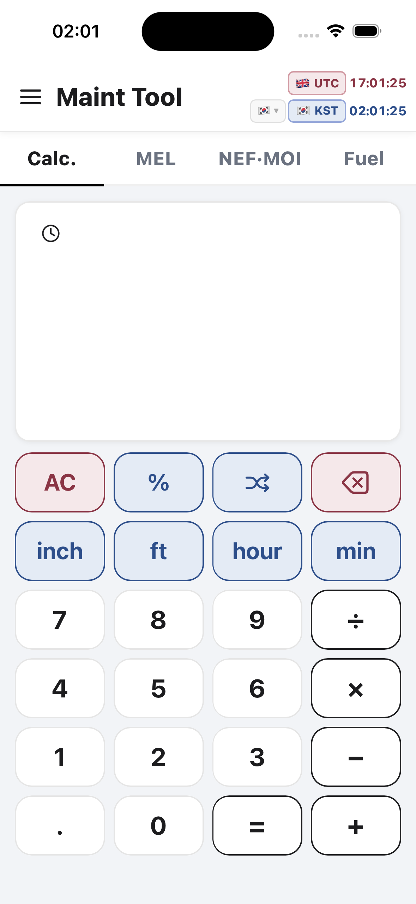

# Maint Tool design and accessibility audit

Date: 2026-09-04  
Surface: iPhone 15 Pro simulator, 393 × 852 points, iOS 26.5  
Scope: current calculator launch state, accessibility text-size response, system dark appearance, and the patched launch state

## Overall verdict

The calculator launch screen is visually stable and usable at the target viewport. The hierarchy is clear, all six keypad rows fit without clipping, and the primary controls have generous touch areas. The current visual direction is not yet owner-approved, so no broad layout or palette redesign was made.

The main accessibility gap observed in this run is that iOS accessibility text sizes do not enlarge the web UI. User zoom was also disabled in the viewport metadata; the patch removes that restriction. Full Dynamic Type support remains a design-and-layout task because it can change wrapping and vertical fit.

## Steps and health

### 1. Launch calculator — GOOD WITH MINOR RISKS

- Strong: clear app title, selected-tab state, time-zone grouping, consistent muted red/blue system, and large keypad targets.
- Strong: the last keypad row is visible with safe spacing at 393 × 852.
- Risk: the empty white result card has only a clock icon, so first-time users receive little guidance about what will appear there.
- Risk: compact time-zone controls and secondary gray text are visually dense compared with the otherwise large controls.

### 2. Accessibility extra-large text and increased contrast — NEEDS WORK

- The screen is effectively unchanged from the default text-size capture.
- This confirms a likely Dynamic Type/reflow gap; it does not prove assistive-technology behavior beyond the visible result.
- Implemented now: removed `maximum-scale=1` and `user-scalable=no`, restoring browser/WebView user zoom.
- Deferred pending design approval: scalable type tokens, wrapping rules, and a 200%/accessibility-size reflow pass.

### 3. System dark appearance — LIGHT-ONLY, DECISION NEEDED

- The app remains visually light while the simulator is in dark appearance.
- Contrast stays readable, so this is not a broken state, but the product currently does not follow the system appearance.
- Dark mode should be treated as a product/design decision rather than silently introduced during this code correction.

### 4. Patched build launch — GOOD

- The React/Capacitor app built, synced, installed, launched, and retained the same visible layout after the calculation-core and accessibility changes.
- No visual regression is visible on the captured launch surface.

## Highest-impact next design decisions

1. Decide whether Dynamic Type must be fully supported while preserving all six keypad rows, or whether the calculator may scroll/reflow at accessibility sizes.
2. Decide whether the large empty result card needs a short first-use hint or example state.
3. Confirm whether the fourth primary tab should remain `Fuel`; older handoff documentation names `LOG`, while the current source and fresh capture show `Fuel`.
4. Decide whether Maint Tool is intentionally light-only or should follow system dark appearance.

## Evidence limits

The current environment could launch and capture the simulator framebuffer but did not expose an interaction driver for tapping through MEL, NEF·MOI, Fuel, the drawer, or account flows. Those flows are therefore not claimed as visually audited in this run. Keyboard focus order, VoiceOver names/roles, error recovery, and contrast ratios require separate interactive or programmatic checks.
